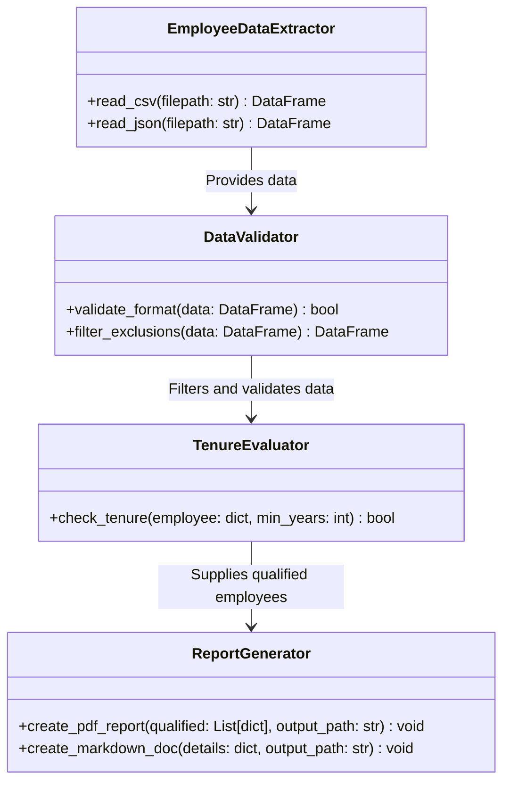
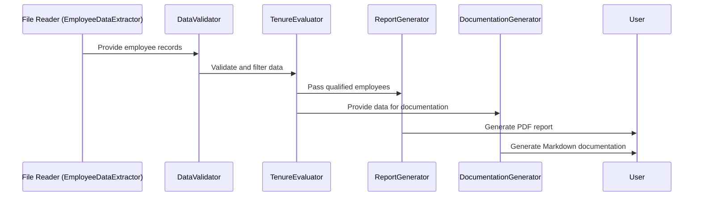

# Implementation Meeting

## Worker_Worker

Below is the proposed output document – "code_implementation_meeting.md" – which details the module implementation plan. Please review and provide any additional feedback.

────────────────────────────────────────────
# Code Implementation Meeting – Module Implementation Plan

This document provides the detailed implementation plan for the Senior Employee Identification System. It includes the module breakdown, dependency diagrams, class/component structures, interface contracts, data models, test plans, implementation sequence, and technical debt considerations.

────────────────────────────────────────────
## 1. Module Breakdown and Dependencies

### Modules and Their Roles
- **Data Extraction Module**
  - Role: Read employee records from CSV/JSON files.
  - Dependency: None external; relies on file I/O libraries (e.g., Python's csv, json).
- **Data Validation & Filtering Module**
  - Role: Validate data format/integrity and apply exclusion filters for contractors and founder's family members.
  - Dependency: Depends on successful output from the extraction module.
- **Qualification Rule Engine**
  - Role: Evaluate and determine if each employee meets the ≥10 years tenure requirement.
  - Dependency: Receives pre-filtered data from the Validation module.
- **Report Generation Module**
  - Role: Generate a validated PDF report and accompanying documentation.
  - Dependency: Uses output from the Rule Engine and Documentation Generator.
- **Methodology Documentation Generator**
  - Role: Produce Markdown documentation detailing the extraction, validation, and processing steps.
  - Dependency: Interfaces with all processing modules to capture decision logs and criteria.

### Dependency Diagram (Mermaid Syntax)
```mermaid
flowchart TD
  A[Employee Records (CSV/JSON)]
  B[Data Extraction Module]
  C[Data Validation & Filtering Module]
  D[Qualification Rule Engine]
  E[Report Generation Module]
  F[Methodology Documentation Generator]
  
  A --> B
  B --> C
  C --> D
  D --> E
  D --> F
```

────────────────────────────────────────────
## 2. Class/Component Structure and Relationships

### Component Overview
- **EmployeeDataExtractor** (class)
  - Methods: read_csv(), read_json()
  - Role: Load and return data as a DataFrame or list of dictionaries.
  
- **DataValidator**
  - Methods: validate_format(), filter_exclusions(data)
  - Role: Check data integrity; exclude contractors and founder's family.
  
- **TenureEvaluator**
  - Methods: check_tenure(employee_record, min_years=10)
  - Role: Assess if an employee meets the tenure requirement.
  
- **ReportGenerator**
  - Methods: create_pdf_report(qualified_employees), create_markdown_doc(metadata)
  - Role: Produce the final output report and supplementary documentation.
  
- **DocumentationArchiver**
  - Role: Manage storage of documentation files.
  
### Class Diagram (Simplified)


────────────────────────────────────────────
## 3. Interface Definitions and Contracts

### Function Interfaces
- **extract_employee_data(filepath: str) → DataFrame**
  - Reads a file and returns employee records.
  
- **validate_and_filter_data(data: DataFrame) → DataFrame**
  - Validates data format and excludes unwanted records.
  
- **check_tenure_qualification(data: DataFrame, years: int = 10) → List[dict]**
  - Returns a list of employee records that meet the tenure criteria.
  
- **generate_report(qualified_employees: List[dict], output_path: str) → None**
  - Generates a PDF report of the qualified employees.
  
- **generate_documentation(details: dict, output_path: str) → None**
  - Generates a Markdown document that details the methodology and processing logic.

### Code Snippet Example (Interface Contract)
```python
def extract_employee_data(filepath: str) -> list:
    """
    Reads employee data from a CSV or JSON file.
    
    Args:
      filepath: Path to the input file.
    Returns:
      List of employee records (dictionaries).
    """
    # implementation here
    pass

def validate_and_filter_data(data: list) -> list:
    """
    Validates employee record structure and applies exclusion rules.
    
    Args:
      data: List of employee records.
    Returns:
      Filtered list of employee records.
    """
    # implementation here
    pass

def check_tenure_qualification(data: list, min_years: int = 10) -> list:
    """
    Checks each record and determines if the employee has a tenure >= min_years.
    
    Args:
      data: List of filtered employee records.
      min_years: The minimum years of tenure.
    Returns:
      List of qualified employee records.
    """
    # implementation here
    pass

def generate_report(qualified_employees: list, output_path: str) -> None:
    """
    Generates a PDF report listing the qualified employees.
    
    Args:
      qualified_employees: List of employee records.
      output_path: File path for the generated PDF.
    """
    # implementation here
    pass
```

────────────────────────────────────────────
## 4. Data Models and Schemas

### Employee Record Schema
```json
{
  "employee_id": "string or integer",
  "name": "string",
  "tenure": "float or integer (years)",
  "employment_status": "string (e.g., full-time, contractor)",
  "relation_to_founder": "boolean or string (yes/no)"
}
```

### Validation Criteria:
- Tenure must be numeric and greater than or equal to 10.
- employment_status should not equal "contractor".
- relation_to_founder should be False or "no".

────────────────────────────────────────────
## 5. Testing Strategy per Module

### Testing Approach:
- **Unit Tests:** Test each function individually with different edge cases (e.g., missing fields, incorrect data types).
- **Integration Tests:** Ensure data flows correctly between modules, e.g., data output from extractor feeds correctly into the validator.
- **Regression Tests:** Validate that future code changes do not break established functionality.

### Key Test Scenarios:
- Valid CSV/JSON input produces a correct list of employee records.
- Incorrect file format or missing records trigger expected validation errors.
- Exclusion filters correctly remove contractors and founder’s family.
- Tenure evaluation correctly identifies employees with ≥10 years.
- Report generation creates a non-empty PDF and correct markdown documentation.

### Sample Unit Test (using pytest)
```python
def test_check_tenure_qualification():
    test_records = [
        {"employee_id": 1, "name": "Alice", "tenure": 12, "employment_status": "full-time", "relation_to_founder": "no"},
        {"employee_id": 2, "name": "Bob", "tenure": 8, "employment_status": "full-time", "relation_to_founder": "no"}
    ]
    qualified = check_tenure_qualification(test_records, min_years=10)
    assert len(qualified) == 1
    assert qualified[0]["name"] == "Alice"
```

────────────────────────────────────────────
## 6. Implementation Priorities and Sequence

### Priority Order:
1. **Data Extraction Module**
   - Implement file reading functions (CSV/JSON) with error handling.
2. **Data Validation & Filtering Module**
   - Define and implement data format checking and exclusion rules.
3. **Tenure Evaluation (Qualification Rule Engine)**
   - Code the function to check tenure criteria.
4. **Report Generation Module**
   - Create PDF generation and Markdown documentation functions.
5. **Integration Testing**
   - Combine modules and run through full end-to-end tests.
6. **Documentation and Code Review**
   - Update docs based on code modifiers and iterate based on team feedback.

────────────────────────────────────────────
## 7. Technical Debt Considerations

- **Short-Term Simplicity:**  
  - Use basic Python libraries; however, note that repeated parsing of large CSV/JSON files may need optimization.
- **Refactoring Possibilities:**  
  - As complexity grows, consider refactoring into separate classes for data I/O and business logic.
- **Testing Framework Expansion:**  
  - Initially use pytest, but potential to integrate Continuous Integration (CI) pipelines (like GitHub Actions) for regular testing.
- **Documentation:**  
  - Ensure inline comments are maintained. Code readability should be preserved as additional features are added.
- **Error Handling:**  
  - Centralize error logging and handling mechanisms to reduce duplicate code in each module.

────────────────────────────────────────────
## Implementation Sequence Diagram (Mermaid Syntax)


────────────────────────────────────────────
## Next Steps

- [ ] Project Lead: Confirm module assignments and update the task board.
- [ ] Data Specialist: Begin coding the extraction and validation modules.
- [ ] Documentation Specialist: Set up initial documentation repository structure.
- [ ] All: Schedule a follow-up checkpoint meeting (target date: November 15) to review module progress and integration tests.

────────────────────────────────────────────
# Meeting Closing Summary

- **Key Decisions:**
  - The system will be modularized into extraction, validation, evaluation, and reporting components.
  - Interfaces and data models have been explicitly defined.
  - A clear testing strategy is in place to ensure each module functions correctly.
- **Action Items:**
  - Begin module implementation in the defined sequence.
  - Write unit tests for each module as they are developed.
  - Integrate modules and document the process in both PDF and Markdown formats.
- **Next Steps:**
  - Kick off coding tasks and prepare for integration testing.
  - Schedule the next progress review meeting for November 15.
  - Update the GitHub repository with modular code and documentation.

────────────────────────────────────────────
Verification:
- All agenda sections have been addressed.
- Implementation modules, interfaces, data schemas, and test plans are clearly documented.
- The output document aligns with project objectives and technical constraints.

────────────────────────────────────────────
End of Document

Please review the above implementation plan and confirm if it meets expected standards. Once approved, the team will proceed with the module development according to this plan.

